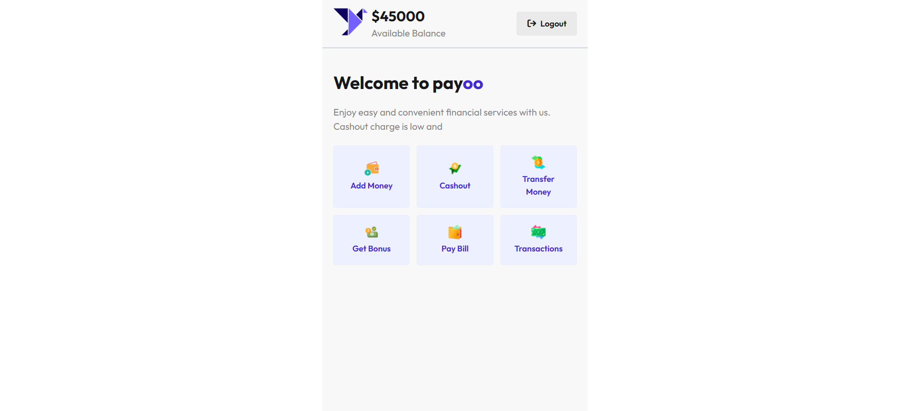
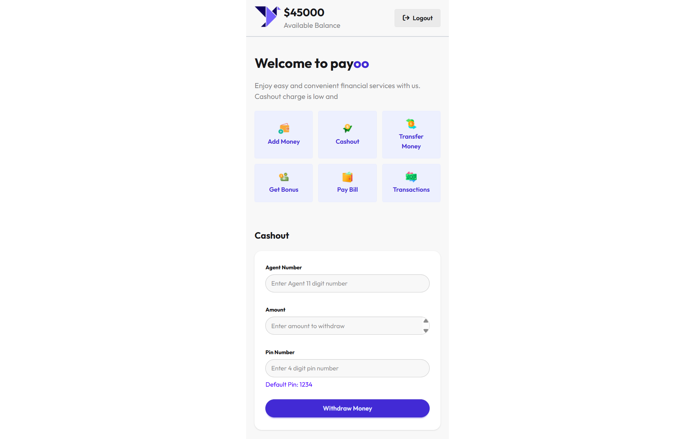
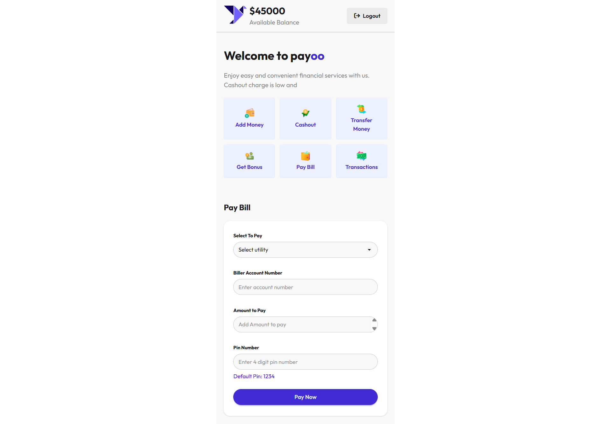
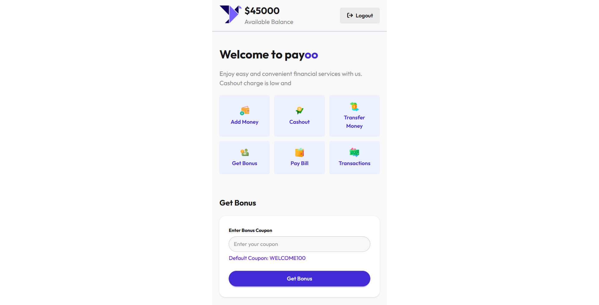

<div align="center">

# 💸 Payoo Smart MFS

### *Smart Mobile Financial Services — Secure, Fast, & Reliable.*

A modern web-based Mobile Financial Service (MFS) platform simulating real-world banking operations with secure authentication, transaction logic, and real-time balance management.

<br/>


<br/>

[](https://developer.mozilla.org/en-US/docs/Web/HTML)
[](https://tailwindcss.com/)
[](https://daisyui.com/)
[](https://developer.mozilla.org/en-US/docs/Web/JavaScript)

</div>

---

## 🚀 Overview

**PAYOO** is a smart Mobile Financial Services (MFS) interface that provides a seamless digital banking experience. Built with HTML, CSS, DaisyUI, and Vanilla JavaScript, it offers a user-friendly platform for managing money transfers and financial transactions. The application supports key banking operations including adding money, cashouts, bonus rewards, and comprehensive transaction history tracking.

---

## 🌐 Live Demo

👉 **[View Live Project](https://payoo-smart-mfs.netlify.app/)**

---

## 📸 Product Showcase

### 🔐 Secure Authentication


Secure login system requiring mobile number and PIN validation to access the financial dashboard.

---

### 🏠 User Dashboard



A centralized dashboard showing available balance and quick access to all financial services.

---

## 💳 Core Transaction System

<details>
<summary><strong>📥 Add Money</strong></summary>
<br/>


> Deposit funds into the wallet with bank integration simulation and validation checks.

</details>

---

<details>
<summary><strong>📤 Cash Out</strong></summary>
<br/>



> Withdraw funds from agent  along with secure PIN verification.

</details>

---

<details>
<summary><strong>💸 Transfer & Bill Payment</strong></summary>
<br/>




> Send money to users or pay utility bills with instant balance updates.

</details>

---

<details>
<summary><strong>📜 Transactions & Rewards</strong></summary>
<br/>




> Track full transaction history and unlock promotional bonuses.

</details>

---

## 🧠 Smart Features

- 🔒 Secure PIN-based authentication  
- ⚠️ Real-time input validation (amount, PIN, balance)  
- 💸 Insufficient balance protection system  
- 📜 Live transaction history ledger  
- 🔄 Instant UI state updates without reload  

---

## 🛠 Tech Stack

| Technology | Purpose |
|------------|---------|
| HTML5 | Structure |
| CSS3 | Styling & Animations |
| Tailwind CSS | Utility-first UI |
| DaisyUI | UI Components |
| Vanilla JavaScript | Business Logic & State Management |

---

## 💡 What I Learned

- Building real-world fintech logic simulation  
- Handling secure user input validation  
- Managing UI state dynamically with JavaScript  
- Designing clean and intuitive financial interfaces  
- Implementing error-safe transaction workflows  

---

## 🚀 Getting Started

```bash
git clone https://github.com/abutalha08/payoo-mfs.git
cd payoo-mfs
```

---

## 📱 Responsive Design

Payoo Smart MFS is fully responsive and optimized for all screen sizes, including mobile, tablet, and desktop devices. The interface adapts seamlessly to ensure a smooth and consistent user experience across all platforms.

---

## 💙 Author

<div align="center">

Made with 💙 by [Abu Talha Taufique](https://github.com/abutalha08)

*Payoo Smart MFS — simulating secure and intelligent digital banking experiences.*

© 2026 Payoo Smart MFS. All rights reserved.

</div>